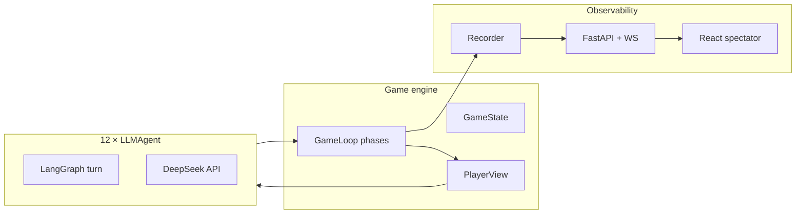

<div align="center">

# 🐺 AIWolfGame

**12-player AI Werewolf (预女猎白) powered by LLM agents — engine, spectator UI, and god-view logs.**

[English](README.md) · [中文](README_zh.md)


-0066FF)
[](LICENSE)

</div>

---

## 📖 About

**AIWolfGame** is a multi-agent Werewolf (狼人杀) research and demo stack: a rule-faithful game engine drives 12 independent **LLM agents** through night/day phases, while a **FastAPI + React** spectator shows public or god-view feeds in real time.

Design goals:

- **Strict information isolation** — agents never see `GameState`, only per-player `PlayerView`.
- **Observable games** — JSONL god logs + human-readable chronicles + WebSocket event stream.
- **Less homogenized AI behavior** — per-seat personas, model pool, sampling jitter, speech transcripts, anti-echo prompts.

Authoritative rules: [`rules.md`](rules.md). Human strategy reference (not a hard script): [`game_guide.md`](game_guide.md).

### 🎭 Board & roles (预女猎白)

| Role | Camp | Count | Night | Day (summary) |
|------|------|------:|-------|----------------|
| 🐺 Wolf | Evil | 4 | Pack kill (no tie; empty kill if all agree) | Hide, self-destruct, bluff |
| 🔮 Seer | Good | 1 | Check one player (good/wolf) | Optional claim, sheriff flow |
| 🧪 Witch | Good | 1 | One potion per night (save / poison); no self-save | Hidden or claim when useful |
| 🎯 Hunter | Good | 1 | — | May shoot when killed by wolf or vote (not poison) |
| 🤡 Idiot | Good | 1 | — | Reveal on vote-out → soul state; poison immune in soul |
| 👤 Villager | Good | 4 | — | Vote and analyze only |
| 🎖 Sheriff | Special | 0–1 | — | Elected day 1 (retry rules); **1.5× vote weight**; badge transfer on death |

**Day 1 flow (simplified):** Night → **Sheriff election** (上警 → 警上 speech / 退水 → 警下 vote) → death announce → speeches → exile vote → repeat until win (屠边 / 屠城 per `rules.md`).

### 🧭 Development principles

| Principle | In practice |
|-----------|-------------|
| Rules as source of truth | Engine follows [`rules.md`](rules.md); prompts must not invent roles (e.g. guard / wolf king). |
| Isolation by view | `Visibility.for_player()` is the only path from state → agent; no `GameState` in prompts. |
| Test-driven | `pytest` guards engine, protocol, logging, API; run before large changes. |
| Prompt layering | Full **rules** injected; **game_guide** role-scoped for opponent modeling; soft **role guides** + **personas**. |
| Logs for analysis | File JSONL is **god-only**; public/god split on WebSocket for spectators. |

---

## 🏗 Architecture & stack



| Layer | Technology |
|-------|------------|
| Language | Python **3.11+** |
| Config | YAML — `Config/default.yaml` + gitignored `Config/secrets.yaml` |
| Agent runtime | **LangGraph** + OpenAI-compatible chat API |
| Engine | Frozen dataclass state machine (`engine/`, `protocol/`) |
| Spectator API | **FastAPI**, WebSocket, static frontend |
| Frontend | **React**, TypeScript, **Vite** |
| Tests | **pytest** (142+) |
| Artifacts | `logs/*.jsonl` (god-only), `logs/*.chronicle.txt` |

```
AIWolfGame/
├── Config/              # default.yaml, secrets.yaml
├── schema/              # Pydantic config & agent protocol
├── src/aiwerewolf/
│   ├── agents/          # LLMAgent, personas, model assignment
│   ├── engine/          # loop, day/night, sheriff sub-flow
│   ├── prompts/         # system prompt builder, role guides
│   ├── protocol/        # PlayerView, dispatch, validation
│   ├── logging/         # Recorder, chronicle
│   └── api/             # spectator server
├── frontend/            # React UI
├── tests/
├── rules.md / game_guide.md
└── main.py              # CLI batch games
```

---

## ✨ Highlights

| Feature | Description |
|---------|-------------|
| 🔒 **Anti-leak views** | Roles, wolf chat, seer checks, witch targets — gated by phase and camp. |
| 🗣 **Speech + demeanor** | Agents receive `public_speeches` and emoji demeanor; wolves get `wolf_team_speeches`. |
| 🎲 **Behavior diversity** | Per-seat **persona**, **model_pool** (chat / reasoner / v4-*), temperature & penalty jitter. |
| 🚫 **Anti-template play** | game_guide framed as encyclopedia; anti-echo hints in prompts and user JSON. |
| 🎖 **Sheriff UX** | 上警 / 退水 / 警下 vote logged and shown (badges, phase banner, vote tally). |
| 📜 **God-view logs** | `agent_turn_full` with in-character **reasoning**, actions, wolf negotiation rounds. |
| 👁 **Dual spectator modes** | Public (fog) vs god (full events + post-game dossier). |

---

## 🚀 Quick start

### Prerequisites

- **Python 3.11+**
- **Node.js 18+** and npm (for frontend build / dev)
- **DeepSeek** (or other OpenAI-compatible) API key
- Windows / Linux / macOS; WSL optional for tooling

### Installation

```bash
git clone <your-repo-url>
cd AIWolfGame

pip install -e ".[spectator]"

cd frontend
npm install
npm run build
cd ..
```

### Configuration

1. Copy the secrets template:

   ```bash
   cp Config/secrets.yaml.example Config/secrets.yaml
   ```

2. Edit `Config/secrets.yaml`:

   ```yaml
   llm:
     provider: deepseek
     model: deepseek-chat
     base_url: https://api.deepseek.com/v1
     api_key: "sk-your-key"
   ```

   Or set env var (overrides yaml):

   ```bash
   export AIWEREWOLF_LLM_API_KEY="sk-your-key"
   ```

3. Optional — tune diversity in `Config/default.yaml`:

   ```yaml
   llm:
     model_pool:
       - deepseek-chat
       - deepseek-reasoner
       - deepseek-v4-flash
       - deepseek-v4-pro
     assign_models_per_player: true
     diversify_within_camp: true
   ```

   Remove model names that your API account does not support.

> **Security:** `Config/secrets.yaml` is gitignored — never commit API keys.

---

## ▶️ Running

### 🖥 Production spectator (built frontend)

```bash
python -m aiwerewolf.api.server
```

Open **http://127.0.0.1:8000/** → **Start new game** → watch the table and event feed.

- **Public view** — speeches, votes, deaths, sheriff events only.
- **God view** — full turns, checks, wolf night, dossier at game end.

### 🛠 Development / debugging

**Terminal 1 — API**

```bash
python -m aiwerewolf.api.server
```

**Terminal 2 — Vite hot reload**

```bash
cd frontend
npm run dev
```

Open **http://localhost:5173** (proxies API/WebSocket to port 8000).

**CLI — batch games (no browser)**

```bash
python main.py --count 1 --seed 0
```

| Flag | Meaning |
|------|---------|
| `--count N` | Run N games (`seed + i` per game) |
| `--seed S` | Shuffle roles & personas |
| `--record PATH` | JSONL path (default `logs/game-{seed}.jsonl`) |

**Tests**

```bash
pytest tests/ -q
```

---

## 📂 Logs & replay

| File | Content |
|------|---------|
| `logs/{game_id}.jsonl` | **God-only** events (`agent_turn_full`, checks, wolf ops, …) |
| `logs/{game_id}.chronicle.txt` | Readable god timeline |
| `logs/game-{seed}.jsonl` | Default CLI output |

Each `agent_turn_full` includes `speech`, `demeanor_emojis`, in-character `reasoning`, and `action`.

---

## 🔧 Troubleshooting

| Issue | Fix |
|-------|-----|
| Cannot connect to backend | Start `python -m aiwerewolf.api.server` first |
| Missing API key | Check `Config/secrets.yaml` or `AIWEREWOLF_LLM_API_KEY` |
| Blank page | Run `cd frontend && npm run build` |
| LLM / model errors | Fix `model_pool` names or remove unsupported models |
| Slow games | Normal — 12 LLM calls per speech round; use `--seed` to reproduce |

---

## 📚 Related docs

| Doc | Purpose |
|-----|---------|
| [`rules.md`](rules.md) | Full rule spec (engine truth) |
| [`game_guide.md`](game_guide.md) | Human meta; agents use scoped slices |
| [`CLAUDE.md`](CLAUDE.md) | Contributor / agent collaboration notes |

---

## 📋 Command cheat sheet

| Command | Description |
|---------|-------------|
| `python -m aiwerewolf.api.server` | Spectator server |
| `python main.py --count 1 --seed 0` | CLI game |
| `pytest tests/ -q` | Unit tests |
| `cd frontend && npm run dev` | Frontend dev mode |
