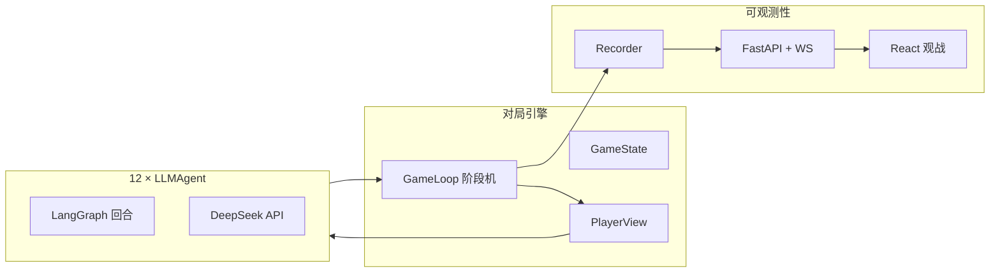

<div align="center">

# 🐺 AIWolfGame

**12 人 AI 狼人杀（预女猎白）— LLM 多智能体对局引擎 + 实时观战 + 全知日志**

[English](README.md) · [中文](README_zh.md)


[](LICENSE)

</div>

---

## 📖 项目简介

**AIWolfGame** 是一套多智能体狼人杀实验与演示系统：规则引擎驱动 12 个独立 **LLM Agent** 完成夜晚/白天全流程，**FastAPI + React** 观战端支持公共视角与上帝视角实时推送。

设计取向：

- **严格信息隔离** — Agent 永不接触 `GameState`，仅通过 `PlayerView` 决策。
- **全程可观测** — JSONL 全知日志、可读 chronicle、WebSocket 事件流。
- **降低同质化** — 人格、多模型池、采样抖动、发言 transcript、反复读 prompt。

规则权威来源：[`rules.md`](rules.md)。人类攻略参考（非行动脚本）：[`game_guide.md`](game_guide.md)。

### 🎭 板子与角色（预女猎白）

| 角色 | 阵营 | 数量 | 夜晚 | 白天（摘要） |
|------|------|-----:|------|--------------|
| 🐺 狼人 | 狼 | 4 | 统一刀口（不可平票；四狼一致可空刀） | 隐藏、自爆、悍跳等 |
| 🔮 预言家 | 好人 | 1 | 验一名玩家（好/狼） | 可跳身份、警徽流 |
| 🧪 女巫 | 好人 | 1 | 每晚最多一瓶药（解/毒），不可自救 | 可藏或适时跳出 |
| 🎯 猎人 | 好人 | 1 | — | 被狼刀或放逐可开枪（被毒不能开） |
| 🤡 白痴 | 好人 | 1 | — | 被投票出局可翻牌免死进灵魂态；灵魂态免疫毒药 |
| 👤 平民 | 好人 | 4 | — | 无技能，投票与盘逻辑 |
| 🎖 警长 | 特殊 | 0–1 | — | 首日竞选；放逐票 **1.5 权重**；死亡须移徽 |

**首日白天（简化）：** 夜晚 → **警长竞选**（上警 → 警上发言/退水 → 警下投票）→ 公布死讯 → 发言 → 放逐投票 → 循环至胜负（屠边/屠城见 `rules.md`）。

### 🧭 开发原则

| 原则 | 落地方式 |
|------|----------|
| 规则即真相 | 引擎严格遵循 [`rules.md`](rules.md)；prompt 不得虚构板外角色（守卫/狼王等）。 |
| 视图隔离 | 仅 `Visibility.for_player()` 生成 Agent 可见信息。 |
| 测试驱动 | `pytest` 覆盖引擎、协议、日志、API。 |
| 分层 Prompt | **rules** 全量；**game_guide** 按角色切片供推理对手；**role guide** + **persona** 软性引导。 |
| 日志分层 | 落盘 JSONL 仅 **god_only**；观战 WebSocket 区分 public / god。 |

---

## 🏗 系统架构与技术栈



| 层级 | 技术 |
|------|------|
| 语言 | Python **3.11+** |
| 配置 | YAML — `Config/default.yaml` + gitignore `secrets.yaml` |
| Agent | **LangGraph** + OpenAI 兼容 Chat API |
| 引擎 | 不可变 dataclass 状态机（`engine/`、`protocol/`） |
| 观战 API | **FastAPI**、WebSocket、静态前端 |
| 前端 | **React**、TypeScript、**Vite** |
| 测试 | **pytest**（142+） |
| 产物 | `logs/*.jsonl`（全知）、`logs/*.chronicle.txt` |

```
AIWolfGame/
├── Config/              # default.yaml, secrets.yaml
├── schema/              # Pydantic 配置与 Agent 协议
├── src/aiwerewolf/
│   ├── agents/          # LLMAgent、人格、模型分配
│   ├── engine/          # 循环、日夜、警长子流程
│   ├── prompts/         # system prompt、角色指南
│   ├── protocol/        # PlayerView、dispatch、校验
│   ├── logging/         # Recorder、chronicle
│   └── api/             # 观战服务
├── frontend/            # React UI
├── tests/
├── rules.md / game_guide.md
└── main.py              # 命令行批量对局
```

---

## ✨ 核心特性 / 亮点

| 特性 | 说明 |
|------|------|
| 🔒 **防信息泄露** | 身份、狼队夜聊、验人、女巫刀口等按阶段/阵营过滤。 |
| 🗣 **发言与神态** | Agent 可见 `public_speeches` 与 emoji；狼可见 `wolf_team_speeches`。 |
| 🎲 **行为差异化** | 每座 **persona**、**model_pool**（chat/reasoner/v4-*）、温度与 penalty 抖动。 |
| 🚫 **降低复读** | game_guide 作百科而非脚本；prompt/user JSON 含反_echo 提示。 |
| 🎖 **警长竞选 UI** | 上警/退水/票型公示写入日志；前端警/退/🎖 徽章与阶段横幅。 |
| 📜 **全知日志** | `agent_turn_full` 含角色内 **reasoning**、行动、狼队协商轮次。 |
| 👁 **双视角观战** | 公共迷雾 vs 上帝全知 + 赛后 dossier。 |

---

## 🚀 快速开始

### 环境依赖

- **Python 3.11+**
- **Node.js 18+** 与 npm（前端构建/调试）
- **DeepSeek**（或其他 OpenAI 兼容）API Key
- Windows / Linux / macOS

### 安装步骤

```bash
git clone <your-repo-url>
cd AIWolfGame

pip install -e ".[spectator]"

cd frontend
npm install
npm run build
cd ..
```

### 配置指南

1. 复制密钥模板：

   ```powershell
   copy Config\secrets.yaml.example Config\secrets.yaml
   ```

2. 编辑 `Config/secrets.yaml`：

   ```yaml
   llm:
     provider: deepseek
     model: deepseek-chat
     base_url: https://api.deepseek.com/v1
     api_key: "sk-你的密钥"
   ```

   或使用环境变量（覆盖 yaml）：

   ```powershell
   $env:AIWEREWOLF_LLM_API_KEY = "sk-你的密钥"
   ```

3. 可选 — 在 `Config/default.yaml` 调整模型池与多样性：

   ```yaml
   llm:
     model_pool:
       - deepseek-chat
       - deepseek-reasoner
       - deepseek-v4-flash
       - deepseek-v4-pro
     assign_models_per_player: true
     diversify_within_camp: true
   ```

   若 API 不支持某模型名，从列表中删除即可。

> **安全：** `Config/secrets.yaml` 已在 `.gitignore`，请勿提交密钥。

---

## ▶️ 运行指南

### 🖥 前端展示（生产构建）

```powershell
python -m aiwerewolf.api.server
```

浏览器打开 **http://127.0.0.1:8000/** →「开始新对局」→ 圆桌 + 事件流。

- **公共视角** — 公开发言、投票、死亡、警长事件等。
- **上帝视角** — 完整 turn、验人、狼夜、赛后 dossier。

### 🛠 调试模式（前端热更新）

**终端 1 — 后端**

```powershell
python -m aiwerewolf.api.server
```

**终端 2 — 前端**

```powershell
cd frontend
npm run dev
```

打开 **http://localhost:5173**（Vite 代理 API/WebSocket 到 8000）。

**命令行跑局（无浏览器）**

```powershell
python main.py --count 1 --seed 0
```

| 参数 | 含义 |
|------|------|
| `--count N` | 连续 N 局（第 i 局 seed = `--seed` + i） |
| `--seed S` | 角色与人格洗牌种子 |
| `--record PATH` | JSONL 路径（默认 `logs/game-{seed}.jsonl`） |

**测试**

```powershell
pytest tests/ -q
```

---

## 📂 对局记录

| 文件 | 内容 |
|------|------|
| `logs/{game_id}.jsonl` | **仅全知**事件 |
| `logs/{game_id}.chronicle.txt` | 人类可读时间线 |
| `logs/game-{seed}.jsonl` | CLI 默认输出 |

`agent_turn_full` 含 `speech`、`demeanor_emojis`、角色内 `reasoning`、`action`。

---

## 🔧 故障排查

| 现象 | 处理 |
|------|------|
| 无法连接后端 | 先启动 `python -m aiwerewolf.api.server` |
| 未检测到 API Key | 检查 `Config/secrets.yaml` 或环境变量 |
| 空白页 | `cd frontend && npm run build` |
| LLM/模型报错 | 修正 `model_pool` 或移除不可用模型 |
| 对局很慢 | 正常 — 每轮多次 LLM 调用；用 `--seed` 复现 |

---

## 📚 相关文档

| 文档 | 用途 |
|------|------|
| [`rules.md`](rules.md) | 完整规则（引擎依据） |
| [`game_guide.md`](game_guide.md) | 人类攻略；Agent 使用切片版 |
| [`CLAUDE.md`](CLAUDE.md) | 协作者 / Agent 开发说明 |

---

## 📋 命令速查

| 命令 | 说明 |
|------|------|
| `python -m aiwerewolf.api.server` | 观战服务 |
| `python main.py --count 1 --seed 0` | CLI 跑一局 |
| `pytest tests/ -q` | 单元测试 |
| `cd frontend && npm run dev` | 前端开发模式 |
